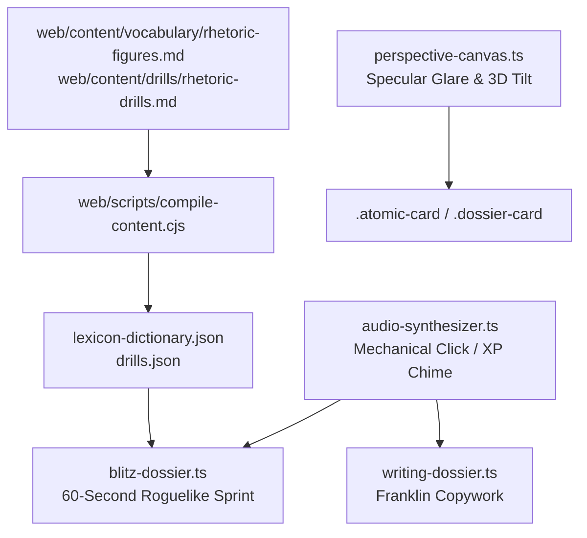

# Design Spec: Cybernetic Constellation Beautification, Ambient 3D Sensory Shimmer & 60-Second Blitz Drill Engine

## 1. Objective & Scope
Elevate the English Singularity learning platform with:
1. **Specular 3D Card Shimmer & Nebula Backdrop**: Gyroscopic / mouse-tracking 3D card tilt with holographic specular sheen and animated starfield nebula on the Constellation Tree.
2. **Mechanical Keystroke Acoustics & Soundscapes**: Procedural tactile audio feedback for typing in Franklin Copywork, XP collection chimes, and streak combo sounds.
3. **60-Second Roguelike Speed Blitz Mode**: Rapid-fire collocation and vocabulary sprint with rolling multiplier, combo meter, countdown tension timer, and particle celebrations.
4. **Master Rhetorical Figures & C2 Stylistic Corpus**: 100 high-level rhetorical and stylistic devices (Chiasmus, Litotes, Zeugma, Antimetabole, etc.) with analysis and drills.
5. **Compiler Integration & QA**: Pre-indexing rhetoric into the offline lexicon dictionary and verification.

---

## 2. Architecture & Components

### Component Details:
1. **Specular 3D Glare & Nebula Canvas (`web/src/core/perspective-canvas.ts`)**:
   - Attaches mousemove listeners with passive damping to calculate 3D tilt (`rotateX`, `rotateY`) and update `--glare-x`, `--glare-y`, `--glare-opacity` CSS variables.
   - Constellation canvas backdrop rendering dynamic drifting nebular gas clusters and twinkling stars at 60fps.
2. **Mechanical Keystroke Acoustics (`web/src/core/audio-synthesizer.ts`)**:
   - Adds `playMechanicalClick(pitchMod = 1.0)`: Low-latency bandpass-filtered noise burst (click) + 120Hz resonant body thock.
   - Adds `playStreakChime(comboCount)`: Ascending arpeggio harmonic based on combo multiplier.
3. **60-Second Speed Blitz Mode (`web/src/modules/blitz-dossier.ts`)**:
   - Accessible via `#blitz` route and Header HUD `[ ⚡ BLITZ ]` button.
   - 60-second countdown with pulse animation.
   - Quick two-choice or fill prompts pulled from collocations and AWL dictionary.
   - Combo multiplier: 1x -> 2x (5 streak) -> 3x (10 streak) -> 4x (15+ streak).
   - Instant particle celebration on completion and XP reward synced with `ProgressionEngine`.
4. **Master Rhetoric Figures (`web/content/vocabulary/rhetoric-figures.md`)**:
   - 100 rhetorical devices formatted with Greek/Latin etymology, syntactic schema, classical exemplar, and C2 executive/academic application.
5. **Compiler & QA Verification (`web/scripts/compile-content.cjs`)**:
   - Merges rhetoric figures into `lexicon-dictionary.json` and generates `rhetoric.json`.

---

## 3. Floor Fleet Allocation
- `dwight-mul1u508`: ENG-49 (Task 1: Specular 3D Card Shimmer & Nebula Canvas)
- `andy-mul1ug04`: ENG-50 (Task 2: Mechanical Keystroke Acoustics & Audio Feedback)
- `phyllis-mul1ur07`: ENG-51 (Task 3: 60-Second Roguelike Speed Blitz Mode)
- `jim-mul1meuh`: ENG-52 (Task 4: Master Rhetoric Figures & Stylistic Corpus)
- `jim-mum0qdlb`: ENG-53 (Task 5: Compiler Integration, Verification Suite & Production Build QA)
